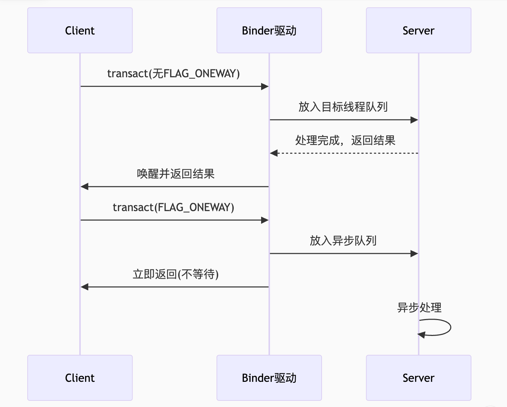

* 看看mmap
```shell
man mmap
```

# 测试，学习mmap


### 4MB Buffer 的本质
内存映射区域

每个使用 Binder 的进程都会通过 mmap 系统调用，在内核空间分配一块 共享内存区域（默认最大 4MB，不同 Android 版本可能不同）

该区域同时映射到 用户空间 和 内核空间，实现零拷贝数据传输。

### 内核数据结构
* 在 Binder 驱动中，这个 buffer 由 binder_alloc 结构体管理：

```c
// kernel/drivers/android/binder_alloc.h
struct binder_alloc {
    struct vm_area_struct *vma;    // 用户空间的内存映射区域
    void *buffer;                  // 内核空间的虚拟地址
    size_t buffer_size;            // 总大小（如4MB）
    struct list_head buffers;      // 分配的buffer列表
};
```
### 与 1MB-8K 事务限制的关系

* 1MB-8K：单次 Binder 调用允许传输的最大数据量（防止单个事务过大）
* 4MB Buffer：所有未完成事务共享的内存池（限制并发传输总量）
### Android Binder 异步事务

# Binder 异步事务是 Android IPC 机制中的一种特殊通信方式，它允许调用方在不等待响应的情况下继续执行，从而提高系统性能和响应速度。下面我将从原理到实践全面解析 Binder 异步事务。

### 一、基本概念
1. 同步 vs 异步事务
   特性	同步事务	异步事务
   等待响应	阻塞等待返回结果	不等待立即继续执行
   使用场景	需要即时结果的操作	可延迟处理的操作
   典型标志	无FLAG或FLAG_ONEWAY	FLAG_ONEWAY
   返回值处理	通过reply Parcel接收	无返回值
2. 核心特点
   单向通信：调用即忘记（fire-and-forget）

* 无返回值：不能通过reply Parcel获取结果

* 有序执行：保证同一Binder对象的异步调用顺序性

二、技术实现原理
1. 内核层实现
   * 在 Binder 驱动中，异步事务（FLAG_ONEWAY）会跳过等待队列的部分逻辑：

```c

// kernel/drivers/android/binder.c
static void binder_transaction(...) {
    if (t->flags & TF_ONE_WAY) {
     // 异步事务特殊处理
     t->need_reply = 0;
     binder_enqueue_thread_work(target_thread, &t->work);
    } else {
     // 同步事务处理
     binder_enqueue_thread_work_ilocked(target_thread, &t->work);
    }
}
```
2. 协议差异
   * 同步事务和异步事务在协议层面的区别：

```c
同步事务协议头：
0x00 0x00 0x00 0x00 | 0x00 0x00 0x00 0x00
└─ 事务标识符          └─ 标志位(无FLAG_ONEWAY)

异步事务协议头：
0x01 0x00 0x00 0x00 | 0x01 0x00 0x00 0x80
└─ 事务标识符          └─ 标志位(含FLAG_ONEWAY)
```
三、使用方式
1. 基础调用示例
   java
*  同步调用
```java
   //
   Bundle data = new Bundle();
   data.putString("key", "value");
   binder.transact(CODE_SYNC, data, null, 0); // 阻塞等待
```

* 异步调用
```java
binder.transact(CODE_ASYNC, data, null, IBinder.FLAG_ONEWAY); // 立即返回
```
2. AIDL 自动生成的异步接口
   java
   // AIDL 定义
   interface IMyService {
   void syncCall(in Bundle data); // 同步
   oneway void asyncCall(in Bundle data); // 异步
   }

* 生成的Stub类会处理FLAG_ONEWAY
```c
@Override
public boolean onTransact(int code, Parcel data, Parcel reply, int flags) {
    switch (code) {
    case TRANSACTION_asyncCall:
        if ((flags & FLAG_ONEWAY) != 0) {
        // 异步处理逻辑
        }
    break;
    }
}
```
### 四、内部工作机制
1. 执行流程对比 

   
2. 内核队列管理
* Binder 驱动维护两种队列：
  * 同步队列：严格按顺序处理，阻塞等待
  * 异步队列：同样有序但不会阻塞调用方

```c
struct binder_thread {
    struct list_head todo;       // 同步事务队列
    struct list_head async_todo; // 异步事务队列

};
```
五、使用场景与最佳实践
1. 适用场景
   * 系统事件通知：如按键事件分发
   * 状态广播：Service状态变更通知
   * 日志记录：非关键日志上报
   * 性能敏感路径：避免主线程卡顿

2. 使用禁忌
   * 需要确认操作结果的场景
   * 必须保证执行顺序的链式调用
   * 事务数据超过1MB-8K限制时（异步同样受限制）

3. 性能优化技巧
   
  ```java
 // 批量异步调用优化
   for (Bundle data : batchData) {
       try {
        binder.transact(CODE, data, null, FLAG_ONEWAY);
       } catch (RemoteException e) {
        // 异步调用也可能因Binder死亡抛出异常
       }
   }
 ```

* 结合Binder连接池

```java
IBinder binder = BinderPool.getBinder(BinderPool.BINDER_CODE);
binder.transact(ASYNC_CALL, data, null, FLAG_ONEWAY);

```
六、问题排查
1. 常见问题
   * 消息丢失：由于异步特性，服务端繁忙时可能丢弃消息 
   * 顺序错乱：虽然单个Binder对象有序，跨对象无法保证 
   * 资源泄漏：忘记回收Parcel可能导致内存泄漏

2. 调试方法
   java
```
   // 检查异步调用是否完成
   if ((flags & IBinder.FLAG_ONEWAY) != 0) {
        Log.d("Binder", "This is an oneway call");
   }
```

* 使用Binder的dump接口
```java
binder.dump(new FileDescriptor(), new String[0]);
```
七、高级特性
1. 异步死亡通知

```java
   binder.linkToDeath(new IBinder.DeathRecipient() {
       @Override
       public void binderDied() {
        // 异步接收Binder死亡通知
       }
   }, 0);
```
2. 与Handler的配合

```java
   // 服务端异步处理示例
   @Override
   public boolean onTransact(int code, Parcel data, Parcel reply, int flags) {
       if ((flags & FLAG_ONEWAY) != 0) {
           Message msg = mHandler.obtainMessage(code);
           msg.obj = data;
           mHandler.sendMessage(msg); // 转到Handler线程处理
           return true;
       }
       return super.onTransact(code, data, reply, flags);
   }
 ```
 

